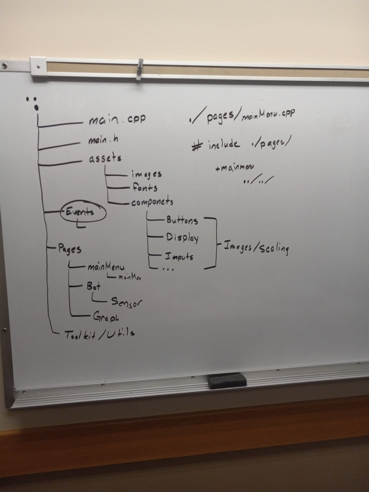

# Project Documentation

## Members Responsibility

All **Push** and **Pull Request** will be done on a members personal branch.

After morning stand up, all members will then commit code that was edited and does not conflict with other members code commits. This will then be pushed to the **development** branch. After the final push to the **development** the team github manager will push to the **main** branch.

Brent Knopp

## Project Overview

This project has 3 phases which include:

1. 3 individual mini games
2. Graphical Calculator
3. Robot Wrapper

Each phase is a stand alone program of the main project.

