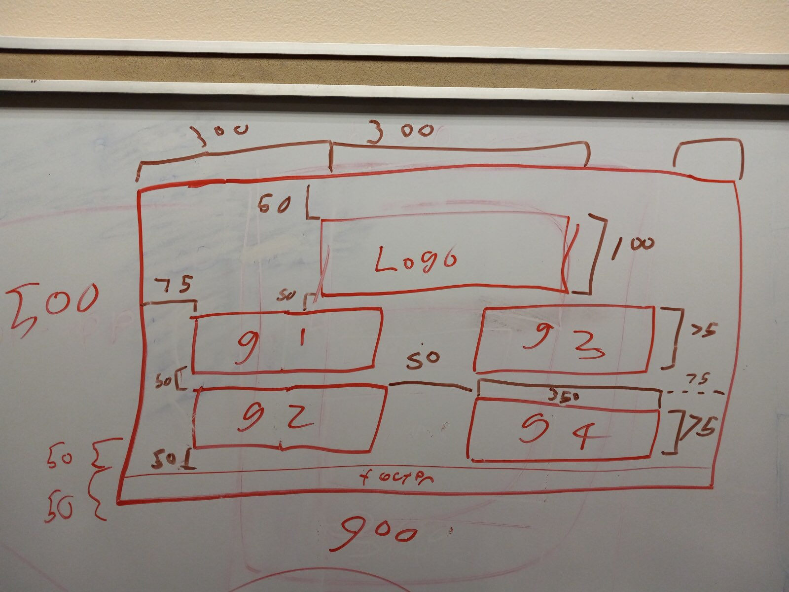

# Project Documentation

## Maintainers

- **[Marty Martin](https://github.com/FancyKat)**
- **[Brent Knopp](https://github.com/bknopp71)**
- **[Nolan Meyers](https://github.com/Lil-Junko)**

## Members Responsibility

All **Push** and **Pull Request** will be done on a members personal branch.

After morning stand up, all members will then commit code that was edited and does not conflict with other members code commits. This will then be pushed to the **development** branch. After the final push to the **development** the team github manager will push to the **main** branch.

## Project Structure

```zsh
.
|-- LICENSE
|-- README.md
|-- assets
|   |-- fonts
|   |   |-- JellyBomb.ttf
|   |   `-- README.md
|   |-- images
|   |   |-- FolderArch.jpg
|   |   |-- Homepage.png
|   |   `-- README.md
|   `-- toolkit
|       `-- README.md
|-- headers
|   |-- README.md
|   |-- animation.h
|   |-- button.h
|   |-- graphBuilder.h
|   `-- particleSystem.h
|-- makefile
|-- pages
|   |-- README.md
|   |-- homepage.cpp
|   `-- menu.cpp
`-- src
    |-- animation.cpp
    |-- button.cpp
    |-- graphBuilder.cpp
    |-- main.cpp
    `-- particleSystem.cpp
```



## Project Overview

This project has 3 phases which include:

1. 4 individual mini games
2. Graphical Calculator
3. Robot Wrapper

Each phase is a stand alone program of the main project.

## Contributing

### Pull Request Process

1. Ensure any install or build dependencies are removed before the end of the layer when doing a build.
2. Update the `README.md` with details of changes to the interface, this includes new environment variables, exposed ports, useful file locations and container parameters.
3. Increase the version numbers in any examples files and the `README.md` to the new version that this Pull Request would represent.
4. You may merge the Pull Request in once you have the sign-off of two other developers, or if you do not have permission to do that, you may request the second reviewer to merge it for you.

### UPDATED...Project OverView

The completed project is a game interface with six application:


## Game 1:Roulette

Pick a number and spin the wheel. Matching number with dealer gives a 35 to 1 payout.
Spin is activated when the spin button is pushed.


## Game 2:Rock Paper Sicssors

Pick either rock, paper or sicssor character. 

rock beats sicssor: sicssor beats paper: paper beats rock

rock = 1

paper = 2

sicssor = 3


## Game 3:Keno

Pick a 1-10 number card, match card with the dealer

2:1 payout


## Game 4:Black Jack

game board built, waiting for logic


## Game 5: Slot Machine

game under construction

## game 6: 3D Engine

game under construction


